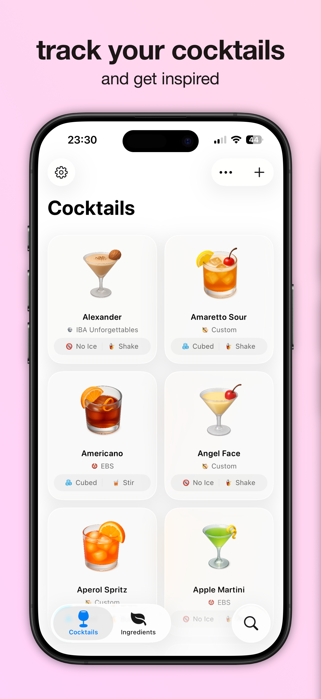
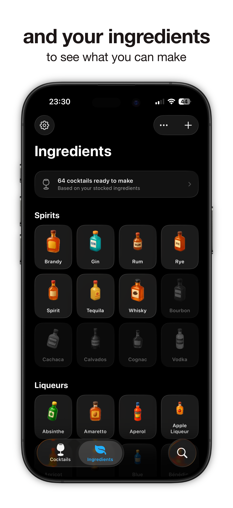
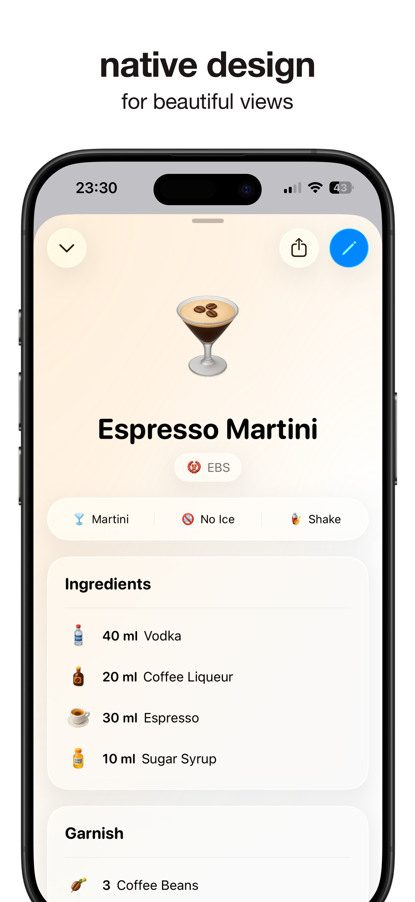
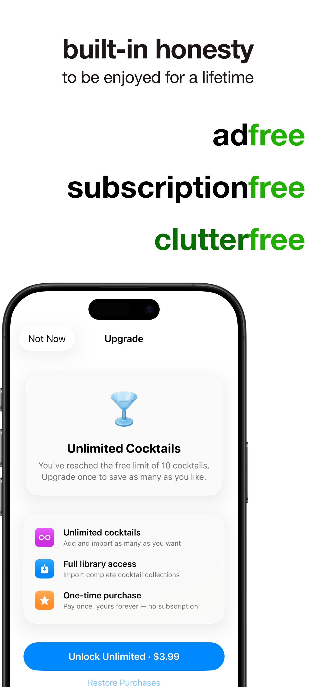

# ClutterFree Cocktails

[**Download on the App Store**](https://apps.apple.com/us/app/clutterfree-cocktails/id6768787366)

A native iOS app for your home bar. Mark which ingredients you have on hand and instantly see which cocktails you can make, browse curated recipe collections, and build your own library.

  
  
  
  

## Tech stack

- Swift, SwiftUI, SwiftData
- StoreKit 2 (one-time in-app purchase)
- App Intents / Siri Shortcuts
- String Catalogs for localization
- Python scripts in `Scripts/` for translations and image generation (OpenAI API)

## Building

Open `Cocktails.xcodeproj` in the latest Xcode and run. To run on a device, set your own team and bundle identifier under *Signing & Capabilities*.

## License

The source code is licensed under the [MIT License](LICENSE).

Images, the app icon, design files, App Store screenshots and the app's name/branding are **not** covered by the MIT License and remain all rights reserved. They're included so the project builds and runs, but may not be reused or redistributed. See [LICENSE](LICENSE) for details.
